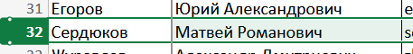
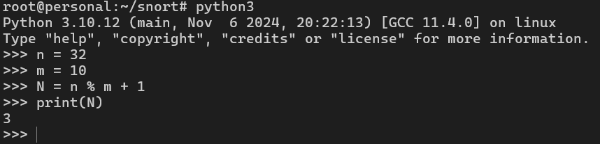
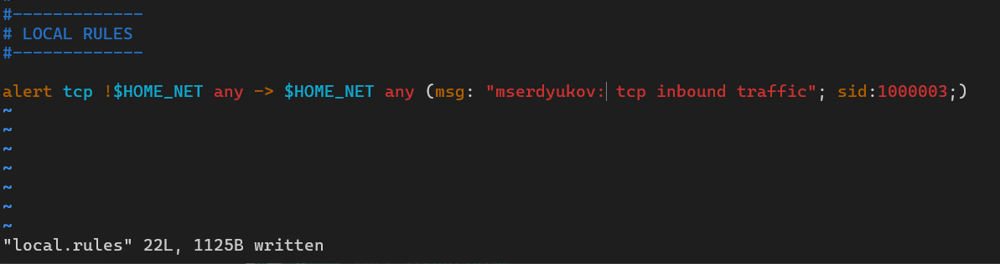
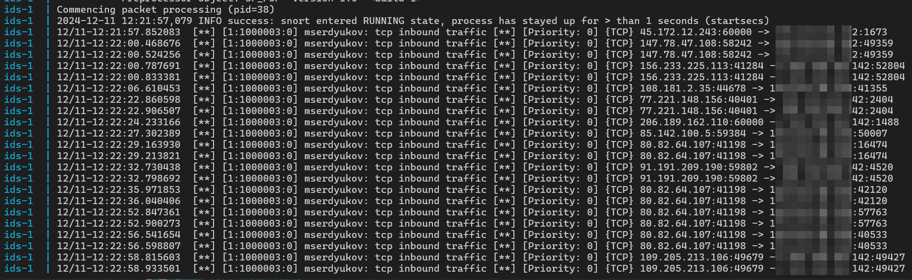

# Практическая работа №2.2 по дисциплине "Управление информационной безопасностью"

Выполнил Сердюков Матвей, ББМО-01-23

## Выбор варианта





> Вариант 3: создать правило для Snort, которое срабатывает при обнаружении всех входящих tcp-пакетов на Ваш ip-адрес с выводом соответствующего сообщения.

## Разработка правила 



Было разработано следующее правило:

```
alert tcp !$HOME_NET any -> $HOME_NET any (msg: "mserdyukov: tcp inbound traffic"; sid:1000003;)
```

Пояснение к правилу:

1. `alert` - тип действия, которое должна совершить IDS при срабатывании правила, в данном случае сгенерировать предупреждение

2. `tcp` - протокол, по которому применяется правило

3. `!$HOME_NET any` - исходящий адрес и порт отправителя. Оператор `!` инвертирует значение, следующее за ним, а в переменной `$HOME_NET` указан IP-адрес узла, на котором развёрнута IDS Snort. Таким образом, эта конструкция обозначает все внешние IP-адреса. `any` обозначает любой порт

4. `$HOME_NET any` - IP-адрес и порт назначения. В данном случае, указан IP-адрес хоста с IDS и любой порт

5. `(msg: "mserdyukov: tcp inbound traffic"; sid:1000003;)` - Дополнительная информация о правиле. В поле `msg` указано краткое описание правила, а поле `sid` содержит уникальный идентификатор правила внутри IDS

## Срабатывание правила

После перезапуска IDS в логе появились срабатывания правила, информирующего о входящем TCP-трафике на IP-адрес защищаемого узла.

